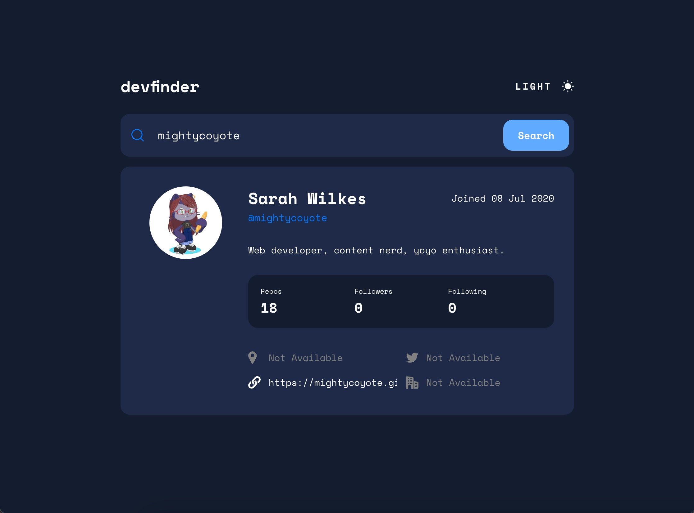

# Frontend Mentor - GitHub user search app solution

This is a solution to the [GitHub user search app challenge on Frontend Mentor](https://www.frontendmentor.io/challenges/github-user-search-app-Q09YOgaH6). Frontend Mentor challenges help you improve your coding skills by building realistic projects. 

## Table of contents

- [Overview](#overview)
  - [The challenge](#the-challenge)
  - [Screenshot](#screenshot)
  - [Links](#links)
- [My process](#my-process)
  - [Built with](#built-with)
  - [What I learned](#what-i-learned)
  - [Useful resources](#useful-resources)
- [Author](#author)

## Overview

### The challenge

Users should be able to:

- View the optimal layout for the app depending on their device's screen size
- See hover states for all interactive elements on the page
- Search for GitHub users by their username
- See relevant user information based on their search
- Switch between light and dark themes
- **Bonus**: Have the correct color scheme chosen for them based on their computer preferences. _Hint_: Research `prefers-color-scheme` in CSS.

### Screenshot



### Links

- Solution URL: [Add solution URL here](https://your-solution-url.com)
- Live Site URL: [Github user search app](https://mightycoyote.github.io/github-user-search-app/)

## My process

### Built with

- Semantic HTML5 markup
- CSS custom properties (used heavily here to apply different colors in darkmode)
- Flexbox
- CSS Grid
- Mobile-first workflow
- Vanilla JavaScript
- Vite
- Octokit
- Localstorage (to check for, or, save a preference if you click the darkmode/lightmode toggle)
- `prefers-color-scheme` if there's no locally saved preference
- Josh W. Comeau's [Modern CSS Reset](https://www.joshwcomeau.com/css/custom-css-reset/) and [Shadow Palette Generator](https://www.joshwcomeau.com/shadow-palette/)

### What I learned

- The darkmode toggle switch in the design consists of an SVG and text together. In order to make the whole thing change color at once when any part of it was hovered, the style has to be applied at the component level instead of the individual pieces. `color` applies to text; `fill` applies to SVGs. (The color itself is given as a variable, and in fact the hover color that's applied is different in lightmode and darkmode.)

```css
.mode-container:hover * {
  color: var(--toggle-hover);
  fill: var(--toggle-hover);
}
```

- The icon and text within the toggle element also both change: it displays "light" and a sun when you're currently in darkmode, and "dark" and a moon when you're currently in lightmode, to indicate the other option that's available. To do this, there are two versions of the component in the HTML at the same time, with one of them always hidden using CSS classes and JavaScript. 

- I had never needed to do much with `grid-template-areas` previously, but in this case, I found that the best way to change the page layout at the desktop breakpoint was to write the CSS to use the `grid-template-areas` property and then redefine it at that breakpoint.

```css
.response-container {
  grid-template-columns: 1fr 1fr 1fr;
  grid-template-areas:
    "avatar intro intro"
    "bio bio bio"
    "stats-box stats-box stats-box"
    "info-columns info-columns info-columns";
}
/* vs */
@media (min-width: 680px) {
  .response-container {
    grid-template-columns: 1fr 1fr 1fr 1fr;
    grid-template-areas:
      "avatar intro intro intro"
      "avatar bio bio bio"
      "avatar stats-box stats-box stats-box"
      "avatar info-columns info-columns info-columns";
  }
}
```

- Github provides dates in the ISO 8602 format (YYYY-MM-DDTHH:mm:ss.sssZ), which is easy for JavaScript to convert into a standard Date object. However, none of the methods on the standard Date object produce the format needed for the design. Rather than choosing one and editing/manipulating the string it produced, I looked for other solutions and found the `Intl.DateTimeFormat` object. With the right options on _that_ object (including `en-GB`), the app displays the "Joined" date correctly without any additional steps.

### Useful resources

[This reply to a date formatting question on Stack Overflow](https://stackoverflow.com/a/67715865) - All of the other proposed solutions to this question involve manipulating a string from some other format, but this answer is an excellent example of how to use `Intl.DateTimeFormat` instead.

## Author

- Website - [Sarah Wilkes](https://mightycoyote.github.io/)
- Frontend Mentor - [@mightycoyote](https://www.frontendmentor.io/profile/mightycoyote)

